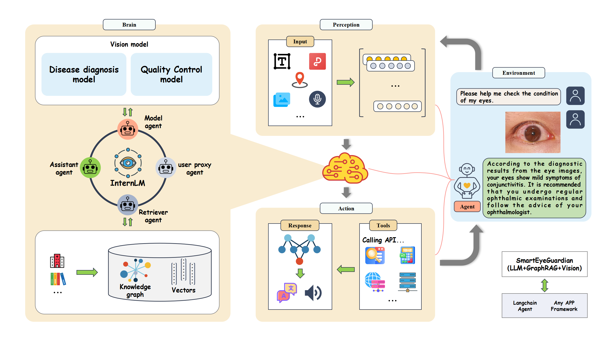

# SmartEyeGuardian
Smart Eye Guardian: Safeguarding Your Eye Health

  

### 📖 项目概述
**SmartEyeGuardian** 是基于[InternLM](https://github.com/InternLM/InternLM.git) 的智眼守护大模型，利用Agent通过整合人工智能技术，实现对多种眼科疾病的精准诊断与预测。项目将利用深度学习和大数据分析，提升眼科临床决策的准确性和效率，推动智能医疗的发展，为患者提供更优质的眼健康管理服务。
我们将会构建EyeMedQA问诊数据集，旨在实现多种眼科疾病问答服务。

<!-- 
🎉更新 
- \[2024/03/15\] 将病种数量提升至4，模型训练时做了数据清洗并使用了msagent的部分数据以提高工具调用能力
- \[2024/02/20\] Lagent版本支持0.2.2
-->

### 🔆 教程安利
如果你也想了解大模型，可以去了解一下哦~[大模型实验营](https://github.com/InternLM/Tutorial)

### 🏷️ 项目架构图
<!-- - 绘画中~🎨-->

  

### 📝 模型使用
- 技术框架:base_model ->InternLM，包括但不限于增量训练。
- 部署环境:具体配置后期更新配置文档。
- 交互方式:用户可以通过命令行或 web 界面与模型进行交互，或者自行下载权重部署。

### 😊 主要功能

- **眼表多病种诊断识别**
- **多种眼底病智能识别**
- **眼科疾病问答服务**
  
### 🚩 项目愿景
完成产业化的AGI眼科医生，实现全眼病诊断和慢病管理。

### 👨🏻‍💻 项目参与人员
- 期待您的参与~

## 特别感谢

感谢上海AILab**书生·浦语实战营**

